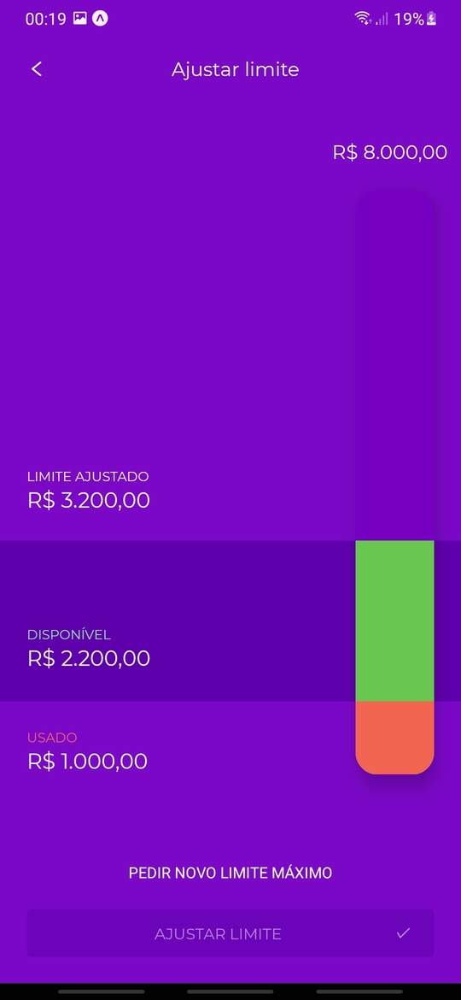

<h1 align="center">
  Nubank redesign built in React Native
</h1>

This design was made by Diego David (https://www.behance.net/gallery/98848371/NuBank-App-Redesign). I decided to implement using react native, applying the new way of making animations with react-native-reanimated.

Only available in Portuguese (BR)

Project made with Expo

### Main libraries

- react-native-reanimated@v2 (animations)
- mobx@6 (state management)
- react-native-magnus (ui components)
- react-native-paper (ui components)
- react-native-shared-element (shared elements)
- react-navigation (screen navigation)

### Demo

  
  
  
  
  
  

### Run with Expo

Scan QRCode from https://expo.io/@misaelbdsantos/nubank-new 
